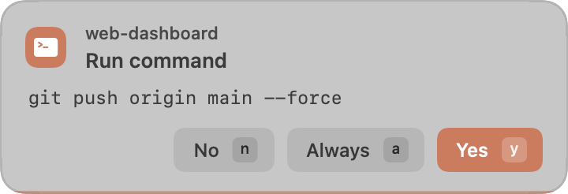
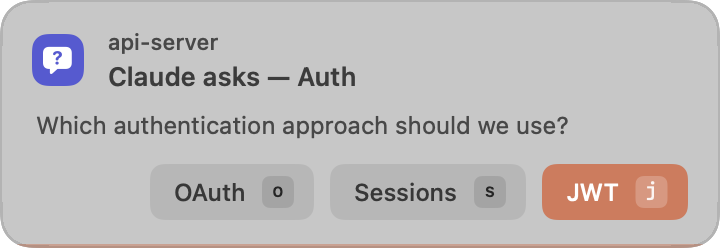
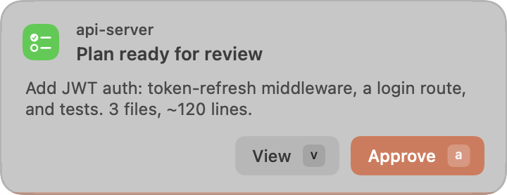

# noti

[](https://github.com/mjbarefo/noti/actions/workflows/ci.yml)

A tiny toast for Claude Code. Instead of a full-screen agent dashboard, `noti`
surfaces only the moments a human is actually needed:

1. **Approval** — when Claude wants to run a command, edit a file, or call a
   mutating MCP tool, a small borderless toast pops in the corner: a tinted
   icon chip + project name (which session, what risk class), the action, and the
   command in monospace, with **Yes / Always / No** buttons that each carry
   their hotkey as a keycap. Your answer becomes Claude's permission decision;
   the terminal prompt never appears. Click, or hover the toast and press
   **y / a / n** (Esc = fall back to the terminal prompt). A hairline drains
   along the bottom edge — when it empties, the prompt moves to the terminal.
2. **Questions & plans** — when Claude asks a multiple-choice question
   (`AskUserQuestion`), a single simple question becomes a toast whose buttons
   *are* the options: one click answers it (the hook returns the answer via
   `updatedInput`, so the terminal picker never appears). Multi-question,
   multi-select, or 4+-option sets get a non-blocking heads-up toast instead —
   the terminal UI (option descriptions, free-text "Other") owns those. When a
   plan is ready (`ExitPlanMode`), the toast shows a preview with
   **Approve / View**: Approve accepts the plan (implementation still goes
   through approval toasts); View, Esc, or timeout hands you the full plan UI
   in the terminal.
3. **Summary** — when a turn ends, a small toast shows a trimmed version of
   Claude's final message plus what it did (`ran 3 commands · edited 2 files ·
   answered 1 question`), then auto-dismisses (hover to hold it, click to
   dismiss early).

Concurrent toasts (several sessions, an approval plus a summary) stack in one
packed column and re-pack smoothly as cards dismiss.

No multiplexer, no panes, no persistent server. You keep using whatever terminal
you already run `claude` in; noti just injects itself at those two points via
Claude Code hooks.

## What it looks like

<table>
<tr>
<td align="center" width="50%">
<picture><source media="(prefers-color-scheme: dark)" srcset="docs/approval-dark.png"></picture><br>
<sub><b>Approval</b> — run a command, edit a file, call an MCP tool</sub>
</td>
<td align="center" width="50%">
<picture><source media="(prefers-color-scheme: dark)" srcset="docs/question-dark.png"></picture><br>
<sub><b>Question</b> — the buttons <em>are</em> the answer options</sub>
</td>
</tr>
<tr>
<td align="center" width="50%">
<picture><source media="(prefers-color-scheme: dark)" srcset="docs/plan-dark.png"></picture><br>
<sub><b>Plan</b> — Approve, or View the full plan in the terminal</sub>
</td>
<td align="center" width="50%">
<picture><source media="(prefers-color-scheme: dark)" srcset="docs/summary-dark.png"></picture><br>
<sub><b>Summary</b> — the trimmed final message + a tool tally</sub>
</td>
</tr>
</table>

<sub>Cards follow the system light/dark palette (shown here in both); the icon
chip's tint is the risk class, its glyph the tool.</sub>

## How it works

```
PreToolUse hook ──▶ noti policy ──┬─ read-only / safe / already-allowed ─▶ allow (silent)
   (Claude blocks)                ├─ deny-listed ──────────────────────── ▶ deny
                                  └─ needs a human ─▶ corner toast ─┬ Yes ─▶ allow
                                                                    ├ Always ▶ allow + write a
                                                                    │         permissions.allow rule
                                                                    ├ No ───▶ deny
                                                                    └ (timeout) ▶ ask  (fall back to
                                                                                 Claude's terminal prompt)
                 AskUserQuestion ─▶ options as buttons ─▶ answer via updatedInput
                                    (complex sets: heads-up toast, answer in terminal)
                 ExitPlanMode ────▶ Approve ─▶ allow  ·  View/timeout ─▶ terminal plan UI
Stop hook ──────▶ trimmed last message + tool tally ─▶ non-blocking summary toast
```

The UI is a ~170-line borderless `NSPanel` Swift binary (`bin/noti-toast.swift`)
with **zero dependencies** and no special macOS permissions — it doesn't steal
focus or switch Spaces. The policy + hook glue is one dependency-free Python
file (`noti`).

## Requirements

macOS 11 (Big Sur) or newer, on **Apple Silicon or Intel** — `./noti build`
produces a universal binary. You need the Xcode Command Line Tools
(`xcode-select --install`) for the one-time build; nothing else. noti is stdlib
Python 3 plus one small AppKit Swift binary, with **zero third-party
dependencies** — no package manager, no runtime to install.

## Quick start

```bash
git clone https://github.com/mjbarefo/noti && cd noti
./noti build          # compile the universal toast binary (needs Xcode CLT)
./noti doctor         # check state
./test.sh             # run the policy tests (no GUI)

# see a toast:
./noti notify --title noti --body $'it works\nran 0 commands'
./noti ask --title "Run command" --message "rm -rf build" --buttons Yes,Always,No

# wire into Claude Code (writes ~/.claude/settings.json, backs it up first):
./noti install                 # everywhere
./noti install --project .     # this project only
./noti uninstall               # remove
```

After installing, start a fresh `claude` session for the hooks to load.

**The clone is the install.** noti's hooks run this working copy in place — there
is no separate copy under `~`. Keep the clone where it is; to upgrade, `git pull
&& ./noti build`. If you move or delete it, sessions simply fall back to Claude's
own terminal prompt (noti fails open, never blocks), and `./noti doctor` will
flag that the installed hook points at a clone that's no longer there.

## Reusable primitives

`noti` is also a general toast CLI any agent or script can call:

```bash
choice=$(noti ask --title "Deploy?" --message "ship to prod" --buttons Yes,No)
[ "$choice" = "Yes" ] && deploy

noti notify --title "Build" --body "all targets compiled" --footer "12s · 0 warnings"
```

Optional styling flags: `--kind run|edit|fetch|mcp|note|question|plan` (tints the
icon chip; run/edit/fetch/mcp render the message in monospace), `--project NAME`
(eyebrow line on ask toasts), `--footer TEXT` (small monospaced line on notify
toasts).

## Configuration

Defaults live in the binary; override any key in `noti.config.json` (repo) or
`~/.config/noti/config.json` (per-user). Notable knobs:

| key | default | meaning |
|---|---|---|
| `toast.corner` | `top-right` | toast placement |
| `toast.ask_timeout_seconds` | `90` | toast self-dismisses → falls back to the terminal prompt |
| `toast.hotkeys` | `true` | hover-armed keyboard shortcuts on the ask toast (see safety notes) |
| `approval.governed_tools` | Bash, Edit, Write, MultiEdit, NotebookEdit, WebFetch | which tools can toast |
| `approval.govern_mcp` | `true` | route MCP tool calls through noti |
| `approval.surface_questions` | `true` | toast `AskUserQuestion` (simple ones answerable from the toast) |
| `approval.surface_plans` | `true` | toast `ExitPlanMode` with Approve / View |
| `approval.mcp_autoallow_servers` | `[]` | servers whose read-only calls auto-allow; empty = every MCP call prompts |
| `approval.bash_safe_commands` | ls, git status, grep, … | auto-allowed read-only verbs (no exec/write/delete flags, no shell metacharacters) |
| `approval.bash_always_mode` | `exact` | `exact` = "Always" rule matches only this command (safe); `prefix` = broader |
| `approval.rule_scope` | `project_local` | where "Always" writes rules: `project_local` / `project` / `global` |
| `summary.show_tally` | `true` | append `ran N commands · edited M files` |

## Safety notes

- A bug in `noti` can **never** block your session: every hook path defers to
  Claude's normal permission flow on any error, and never exits non-zero.
- The Bash auto-allow list is a real security surface — it fires only for the
  listed read-only verbs, refuses shell metacharacters (`; | & $ \` ( ) < >`), and
  refuses write/exec/delete flags (`-exec`, `-delete`, `--pre`, …). `env`, `find`,
  and `rg` are deliberately excluded (they can exec/delete without metacharacters).
- MCP auto-allow is **opt-in**: by default every governed MCP call prompts. Add a
  server to `mcp_autoallow_servers` to silence its read-only calls; mutating method
  names still prompt.
- `deny` rules always win — they're checked before every allow path, in every mode
  (including question/plan surfacing). In `dontAsk` mode noti never shows a
  *permission* toast (you asked not to be asked) — questions and plans still
  surface, because the session blocks on them regardless of permission mode.
- Answering a question from the toast uses the PreToolUse `updatedInput` channel
  with the **exact** question/option strings. A Claude Code too old to support
  it simply ignores the field and asks in the terminal — degraded, never a
  wrong answer. Anything the toast can't represent faithfully (multi-select,
  4+ options, free-text "Other") is never answered from the toast at all.
- **Hotkeys are hover-armed.** The toast only captures the keyboard after the
  mouse *moves* over it, and releases it the moment the mouse leaves. A toast
  appearing while you type — even directly under a parked cursor — can never
  swallow an in-flight "y" and approve something you didn't read. Set
  `toast.hotkeys: false` to go back to click-only.
- "Always" writes the **exact** command/path/domain, never a broadened glob, and
  refuses to write if your settings file is unparseable (it never clobbers it; it
  keeps a `.noti-prev` copy). Commands ending in `*` are never minted at all —
  Claude's engine would read the trailing `*` as a prefix rule, i.e. broader than
  what you approved ("Always" quietly degrades to a one-time "Yes").
- `noti install` backs up your `settings.json` before editing and is idempotent.
- It coexists with herdr / ccbaton (those use different hook events).

## Known limitations

- `noti`'s policy matcher approximates Claude's permission engine. It understands
  the documented rule forms — `Bash(cmd)`, `Bash(cmd:*)`, `Bash(cmd *)`, path
  anchors (`//abs`, `~/home`, `/project-root`, relative), `WebFetch(domain:…)`,
  `mcp__server`, `mcp__server__tool`, and `mcp__server__get_*` wildcards — but
  where they diverge it errs strict: a bare trailing `*` in a Bash rule is
  matched literally, not as a prefix (worst case: noti toasts on something
  Claude would have auto-allowed).
- Hotkeys require one mouse motion over the toast to arm — that's deliberate
  (see safety notes), but it means there's no fully hands-off keyboard answer.
- macOS only.

## License

[MIT](LICENSE) © 2026 Jacob Barefoot.
